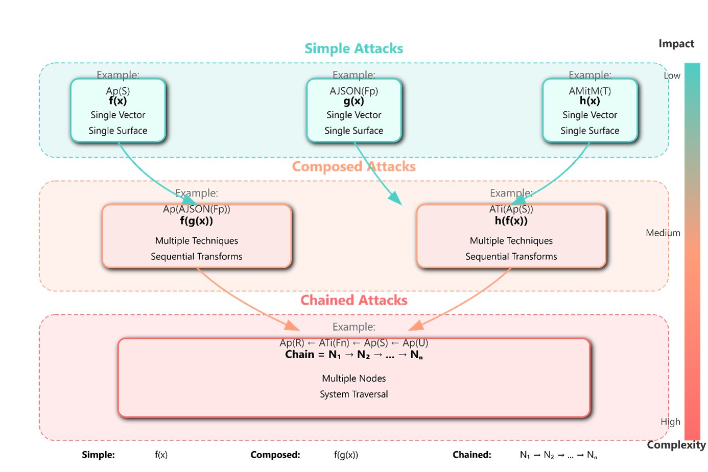

# Bridging AI and Software Security: LLM Agent Vulnerability Assessment Framework

[](https://opensource.org/licenses/MIT)
[](https://www.python.org/downloads/)
[](https://arxiv.org/abs/2507.06323)
[](https://github.com/theconsciouslab-ai/llm-agent-security)

## 📰 Paper

**Bridging AI and Software Security: A Comparative Vulnerability Assessment of LLM Agent Deployment Paradigms**

*Tarek Gasmi, Ramzi Guesmi, Jihene Bennaceur, Ines Belhadj*

[Read Paper](https://arxiv.org/abs/2507.06323) | [Cite](#citation)

## 🎯 Overview

This repository contains the implementation of a comprehensive security testing framework for LLM-based agents, evaluating vulnerabilities across **Function Calling** and **Model Context Protocol (MCP)** deployment paradigms. Our research bridges the gap between AI-specific and traditional software security domains through systematic vulnerability assessment.

### Key Findings

- 🔍 **3,250 attack scenarios** tested across 7 language models
- 📊 Function Calling showed **73.5% attack success rate** vs **62.59% for MCP**
- ⚡ Chained attacks achieved **91-96% success rates** across all configurations
- 🧠 Advanced reasoning models demonstrated higher exploitability despite better threat detection

## 🏗️ Framework Architecture


*Figure: Our three-tier attack progression model showing simple, composed, and chained attacks with increasing complexity and impact*

Our framework evaluates two primary deployment paradigms:

| Paradigm | Description | Key Characteristics |
|----------|-------------|-------------------|
| **Function Calling** | Centralized orchestration model | Platform-specific, manual integration |
| **Model Context Protocol** | Distributed client-server architecture | Dynamic, standardized protocol |

## 🚀 Quick Start

### Prerequisites

- Python 3.10+
- API access to LLM providers (Azure OpenAI, AWS Bedrock, Anthropic)

### Installation

1. **Clone the repository**
```bash
git clone https://github.com/theconsciouslab-ai/llm-agent-security.git
cd llm-agent-security
```

2. **Install dependencies**

For MCP configuration:
```bash
pip install -r mcp.requirements.txt
```

For Function Calling configuration:
```bash
pip install -r function_calling.requirements.txt
```

3. **Configure environment**

Create a `.env` file:
```env
# Azure/OpenAI (Function Calling)
AZURE_OPENAI_API_KEY=your_key
AZURE_OPENAI_ENDPOINT=your_endpoint
AZURE_OPENAI_API_VERSION=2023-12-01-preview

# AWS Bedrock (Function Calling)
AWS_ACCESS_KEY_ID=your_key
AWS_SECRET_ACCESS_KEY=your_secret
AWS_REGION_NAME=us-east-1

# Model Configuration
AZURE_OPENAI_MODEL_NAME=gpt-4
AWS_MODEL_NAME=anthropic.claude-v2
```

### Running Attacks

**Test MCP Agent:**
```bash
python -m mcp.attacks.main
```

**Test Function Calling Agent:**
```bash
python -m function_calling.attacks.main
```

## 📊 Evaluation Framework

### Attack Categories

| Category | Description | Success Rate |
|----------|-------------|--------------|
| **Simple Attacks** | Single-vector exploits | ~50% |
| **Composed Attacks** | Multi-technique combinations | 70% (FC), 51% (MCP) |
| **Chained Attacks** | Multi-stage exploit sequences | 91-96% |

### Metrics

- **ASR (Attack Success Rate)**: Percentage of successful exploitation
- **RR (Refusal Rate)**: Agent's defensive awareness
- **AF (Amplification Factor)**: Impact of attack complexity

## 🛠️ Extending the Framework

### Adding New Attack Vectors

1. Define attack in `attacks/attack_types/`
2. Implement attack logic following the base template
3. Register in attack taxonomy

### Custom Tool Integration

**For MCP:**
```python
# mcp/domains/custom_domain.py
def custom_tool(params):
    """Your tool implementation"""
    pass
```

**For Function Calling:**
```python
# function_calling/domains/custom_domain.py
TOOLS = [{
    "name": "custom_tool",
    "description": "Tool description",
    "parameters": {...}
}]
```

## 🔗 Related Work

Our framework builds upon and extends several key security evaluation projects:

### LLM Agent Security Frameworks

- **[AgentDojo](https://github.com/ethz-spylab/agentdojo)** - A dynamic environment for evaluating prompt injection attacks and defenses. While AgentDojo achieves 92% effectiveness in DPI defense, our composed attacks maintain 67-74% success rates by exploiting architectural boundaries.

- **[InjecAgent](https://github.com/uiuc-kang-lab/injecagent)** - Benchmarks indirect prompt injections in tool-integrated agents. Reports 24% average attack success rate compared to our simple attack baseline of 45.3%.

- **[Agent Security Bench (ASB)](https://github.com/google/agent-security-bench)** - Evaluates agent vulnerability to 12 attack types with 56.44% average success rate. Our framework extends this by introducing cross-domain attack compositions.

### Defense Mechanisms

- **[LLM-Guard](https://github.com/protectai/llm-guard)** - Comprehensive security toolkit for LLM applications focusing on input/output filtering. Complements our architectural security approach.

- **[ReAct Framework](https://github.com/yoheinakajima/react)** - Synergizes reasoning and acting in language models. We demonstrate how ReAct's sequential processing can be exploited through chained attacks.

- **[LLM-Agent-UMF](https://github.com/hassouna/llm-agent-umf)** - Unified modeling framework for multi-agent systems. Provides architectural patterns that informed our MCP security analysis.

### 🎯 Key Contributions

This framework introduces several novel contributions to LLM agent security research:

- **Unified Threat Classification Framework** - Bridges traditional software security (STRIDE) with AI-specific vulnerabilities (ATFAA) in a single taxonomy
- **Cross-Domain Attack Modeling** - First systematic evaluation of attacks that span both AI and software boundaries
- **Architectural Security Analysis** - Comparative assessment revealing how deployment paradigms fundamentally shape vulnerability profiles
- **Attack Progression Formalization** - Mathematical model demonstrating how attack complexity amplifies success rates (up to 2x)
- **Extensible Testing Pipeline** - Automated framework for evaluating new models, architectures, and attack patterns

## 📚 Citation

If you use this framework in your research, please cite:

```bibtex
@article{gasmi2025bridging,
  title={Bridging AI and Software Security: A Comparative Vulnerability Assessment of LLM Agent Deployment Paradigms},
  author={Gasmi, Tarek and Guesmi, Ramzi and Bennaceur, Jihene and Belhadj, Ines},
  journal={arXiv preprint arXiv:2507.06323},
  year={2025}
}
```

## 📄 License

This project is licensed under the MIT License - see the [LICENSE](LICENSE) file for details.

---

<p align="center">
  <a href="https://github.com/theconsciouslab-ai">
    
  </a>
</p>
